# Welcome to Jocasta

Jocasta is a rename of JSMooCh.

JSMooCh started as C ports of my JavaScript emulators from JSMoo. It has since then expanded into more emulators. It is not really meant for the public to use, despite having some fairly accurate and good cores.

I also eventually ported to C++, because I missed features like basic templating. This made it a lot easier to do things like combine my ARM7TDMI/ARM946ES cores into one and cache them without a BUNCH of duplicated code.

There is a fairly heavy emphasis on debugging, with cores offering different features as they make sense for a platform.

jocasta-gui is the front-end GUI app.
jocasta-lib is the C11 library of emulators, agnostic to front-end.
jocasta-tests are some tests for jocasta-lib
jocasta-cast is a very WIP, not too great test on Dreamcast

## But does it run DOOM?
Yes, actually, twice over: on GBA and PlayStation 1. I'm sure there's a homebrew port that would run on the NDS core, and vaguely confident a similar Dreamcast one would run as long as it doesn't need the GDROM.

## jocasta-gui progress
jocasta-gui, the front-end, is coming along a lot, but isn't very well-tested.

It's mostly there to look pretty sometimes. This is a project mostly for me. If someone else uses it as reference for their own emulator later, great! If someone wants to play a game on it...? Well, I hope it works for you :-D

## jocasta-lib/core progress
All of the emulator cores share a common interface based around describing the phyiscal I/O needed (no hardware-accelerated rendering, yet).

The emulators are not all the fastest. The emphasis has been on making them "fast enough for me" while also being very accurate and easy to understand. With that said, many of them are not total slouches in speed either, it just wasn't the emphasis.

"Fast enough" depends on the core. On my MacBook Air M4, NDS runs at ~150-200FPS depending on the 3d scene. Sega Genesis around 270FPS, GBA around 700FPS. It's all tradeoffs made usually toward accuracy in the cores. Here's a core-by-core progress list with some screenshots.

## Apple IIe
Boots to BASIC. Has Disc Drive support (no .woz and flux images yet though), and Mockingboard is coming soon. 

## Atari 2600
Needs a lot of work. You can play some games now though!

## Commodore 64
Boots the BIOS to BASIC, and you can do some BASIC stuff. I've managed to get a few games in .prg format to run. I've not implemented a lot of hardware or GFX modes yet.

To run a .PRG, do file...load with it. Then after it boots to BASIC, click the "Load selected file" button in the "Core Options" window. Now type run then enter.

## Casio PV-1000
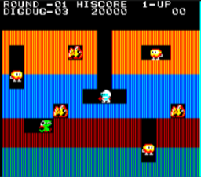

Works with games! I've only tried 3, but they work accurately to hardware.

## Cosmac VIP
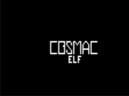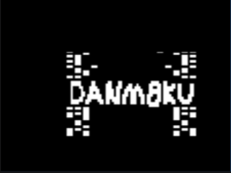

Works great! Also sideloads chip8 programs great!

## Dreamcast
Loads and plays some homebrew, boots BIOS to the point of 3d commands. Only just begun implementing 3d commands.

## Galaksija
The Yugoslavian microcomputer from the 80's! Boots and displays properly. Not really tested beyond that, lacks tape support too.

## GameBoy/Color
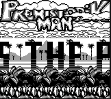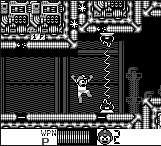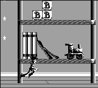

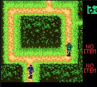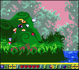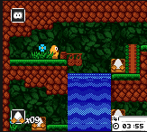

Works, with sound, pretty well. A few incompatible GBC games, and a few with glitches but working, but mostly a competent core. Supports save states.

## GameBoy Advance
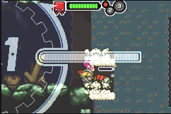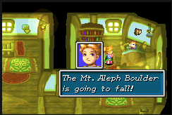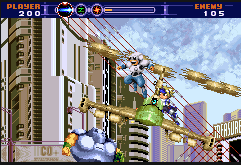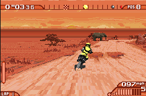

Works, with sound, pretty well. A fairly competent core with decent accuracy. Supports save states.

### Known Issues
- No RTC, sun sensor, etc. yet
- MegaMan Zero 3 has some scroll issues

## Genesis/MegaDrive
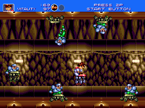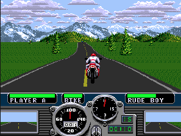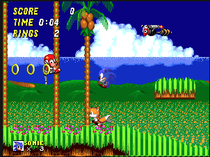

Works, with decent sound, pretty well. I've tried over 70 games and gotten about 97% compatability with zero or unnoticeable glitches. Supports save states.

## Mac Classic
Boots to sad Mac. Needs work on floppies.

## NES
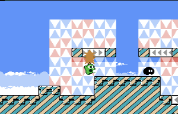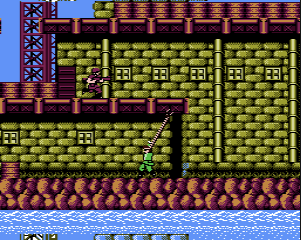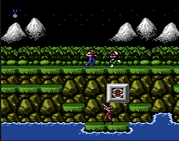

Pretty good compatability, with sound. Supports save states.

### Known issues
- MMC5 support is incomplete/bad
- Sound sweep could be better, mostly doesn't affect most games

## Nintendo DS
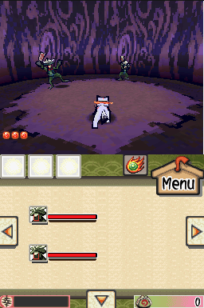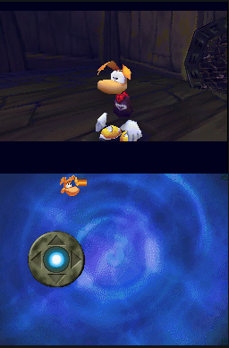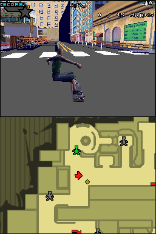

Plays roughly 40-60%? of the library fine? There's tons of accuracy issues with it, but I'm fairly happy with it for now.

### Known issues
- Rendering inaccuracies. Games still look good! Wireframe polys unsupported, anti-aliasing unsupported, fog table...
- Various game issues, and plenty of them

## NeoGeo
Plays a bunch of AES games well. Sound is WIP, graphical glitches present here and there.

## NeoGeo Pocket/Color
Early WIP, CPU not even done yet.

## Master System/Game Gear/SG1000
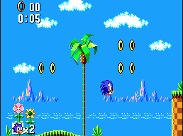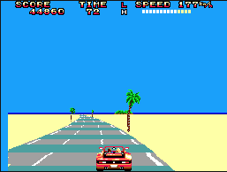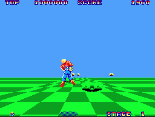

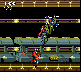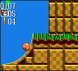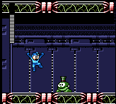

Pretty good compatability, with sound. Supports save states.

## PlayStation 1
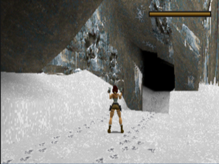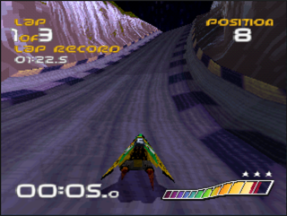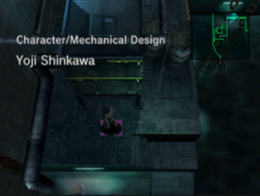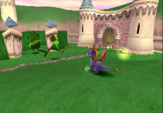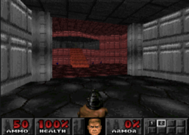

Running many games very well. Some CD-ROM compatability issues in a few games, but the majority seem to work well.

## Super NES
Runs a few games, with sound. Honestly needs more work, nowhere near complete.

### Known Issues
- PPU mosaic not implemented
- No add-on chips

## TurboGraFX-16
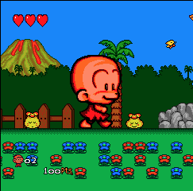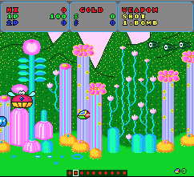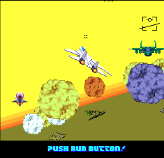

Has lowest-level timing of any TG16 emulator I've seen the source to. A decent portion of games work and sound mostly? works.

### Known Issues
- Detana Twinbee, Gradius, Alien Crush do not work
- Legendary Axe 2 crashes after menu
- Neutopia has serious issues

## ZX Spectrum
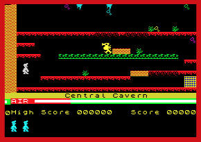

Plays most? games fine, but not thoroughly tested. The only real thing that works at all is loading .tap file and doing the normal stuff to run it on ZX. This will automatically activate fast-load.

## Build status

## A note on AI use
I'm generally not a fan of AI as it is presented in the hype, but I do find it a useful tool at times.
For instance, I wouldn't have a way to load files without recompiling, or take screenshots without it. I'm just NOT interested in doing most UI work. But I can tell ChatGPT to add a Load menu, and it'll magically appear. So why not?

ChatGPT and Claude built upon the foundation I laid in the GUI and made a "functional" emulator GUI out of it over just a few days. So that's probably why I'm releasing it. 

In terms of the emulator cores, I've used AI to chase down a few specific and long-standing bugs I couldn't be bothered to fix, such as Wario Land 3 on GBC's sprite issues. Other than that, these cores are 99.999% human-made, and I intend them to remain that way.

The other extensive things, outside of GUI and in the emulator cores, that I have tasked the AI with are:

* NES was my first C->CPP port, and I was never happy with the structure I came up with. ChatGPT was able to rewrite it in the same shape as all the other emulator cores a lot quicker and easier than I was.
* Using my previous work as examples and guide, I am having ChatGPT add serialization (save states) to consoles that don't support it. This is an annoying and tedious step, something LLM's are great at.
* The Windows cross-build, Linux x64 cross-build, and macOS build automation are totally made by ChatGPT

With that said, AI is still only a tool. I don't believe LLM's are fundamentally suited to write their own emulators from scratch, and experience and experiments have shown it. I value human work, and I thought that AI could contribute to this emulator specifically by making it actually useful to someone.

